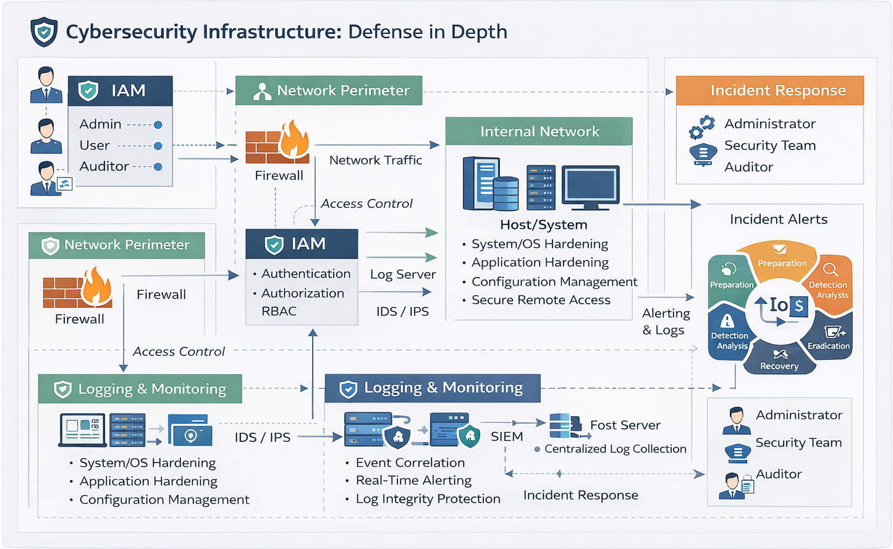

# System Architecture – Secure Cybersecurity Infrastructure

## 1. Overview
This document describes the high-level architecture of a secure infrastructure designed using defensive cybersecurity principles.  
The architecture focuses on protecting systems, controlling access, monitoring activity, and responding to security incidents.

The design follows the principle of **Defense in Depth**, where multiple security layers work together to reduce risk.

---

## 2. Architecture Components

### 2.1 User Layer
This layer represents legitimate users who access the system.

Types of users:
- Administrator
- Standard User
- Auditor (Read-only)

Security considerations:
- Strong authentication
- Role-based access control (RBAC)
- Least privilege enforcement

---

### 2.2 Identity & Access Management (IAM)
IAM controls **who can access what** within the system.

Responsibilities:
- User authentication
- Role assignment
- Permission enforcement
- Access auditing

Why it matters:
- Prevents unauthorized access
- Limits damage from compromised accounts
- Enables accountability

---

### 2.3 Network Security Layer
This layer protects the system from unauthorized network access.

Controls include:
- Firewalls
- Restricted ports
- Secure communication protocols (e.g., SSH)

Purpose:
- Reduce attack surface
- Block unnecessary inbound traffic
- Prevent lateral movement

---

### 2.4 Host / System Layer
This is the core system (server or virtual machine).

Security controls:
- Secure OS configuration
- Service hardening
- File permission management
- Patch management

Goal:
- Prevent privilege escalation
- Protect critical system files
- Ensure system integrity

---

### 2.5 Logging & Monitoring Layer
This layer records and analyzes system activity.

What is logged:
- Authentication attempts
- Access to sensitive files
- Configuration changes
- Network activity

Why logging is critical:
- Enables threat detection
- Supports incident investigation
- Provides forensic evidence

---

### 2.6 Incident Response Layer
This layer defines how the system responds to security incidents.

Key actions:
- Detection
- Alerting
- Containment
- Recovery
- Post-incident analysis

Purpose:
- Minimize damage
- Restore normal operations
- Improve future security posture

---

## 3. Trust Boundaries
Trust boundaries define where security controls must be strongest.

Identified trust boundaries:
- Between users and the system
- Between network and host
- Between normal users and privileged roles

Each boundary requires validation, logging, and access control.

---

## 4. Defense in Depth Mapping
_______________________________________________________________
| Security Layer       | Purpose                              |
|----------------------|--------------------------------------|
| IAM                  | Access control & accountability      |
| Network Security     | Attack surface reduction             |
| System Hardening     | Prevent misuse & escalation          |
| Monitoring & Logging | Detect suspicious activity           |
| Incident Response    | Handle and recover from attacks      |
|_____________________________________________________________|

---

## 5. Security Design Principles Applied
- Principle of Least Privilege
- Defense in Depth
- Secure by Design
- Accountability & Auditing
- Risk Reduction

---

## 6. Summary
This architecture provides a layered security approach that protects systems against common threats such as unauthorized access, misconfigurations, insider misuse, and brute-force attacks.

The design is scalable, auditable, and suitable for both on-premise and cloud-based environments.
